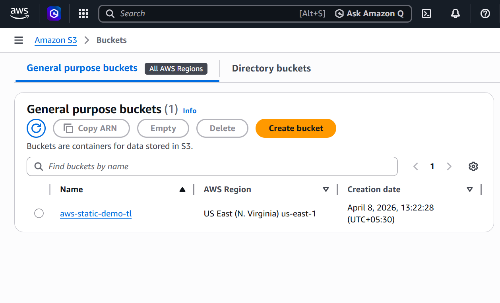
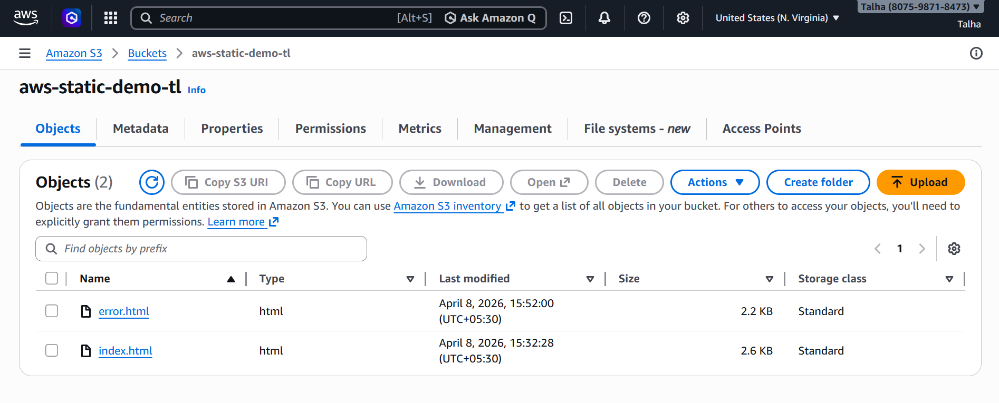
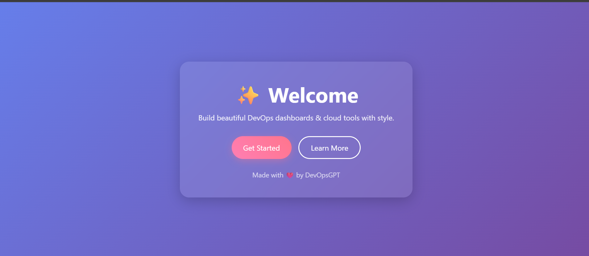

# 🚀 AWS S3 Static Website Hosting

## 📌 Overview

This project demonstrates hosting a static website using Amazon S3.

The website includes:

* A custom homepage (`index.html`)
* A custom error page (`error.html`)
* Bucket policy for public access
* Routing rules for URL redirection

---

## 🛠️ Tech Stack

* **Cloud:** Amazon S3
* **Frontend:** HTML, CSS
* **Version Control:** GitHub

---

## 📂 Project Structure

```
aws-s3-static-website/
│── index.html
│── error.html
│── bucket-policy.json
│── README.md
│── home.png
│── error.png
```

---

## 🌐 Features

* Static website hosting using S3
* Public access via bucket policy
* Custom error page
* URL redirection rules
* Lightweight and fast

---

## ⚙️ Setup & Deployment

### 1️⃣ Create S3 Bucket

* Create a bucket with a unique name
* Disable **Block Public Access**



---

### 2️⃣ Upload Files

Upload:

* index.html
* error.html



---

### 3️⃣ Enable Static Hosting

Go to:

* Properties → Static Website Hosting

Set:

* Index document → index.html
* Error document → error.html


## 🔐 Bucket Policy

```json
{
    "Version": "2012-10-17",
    "Statement": [
        {
            "Sid": "Statement1",
            "Effect": "Allow",
            "Principal": "*",
            "Action": "s3:GetObject",
            "Resource": "arn:aws:s3:::aws-static-demo-tl/*"
        }
    ]
}
```

### Explanation

* Allows public access to all files in the bucket
* `Principal: "*"` → anyone can access
* `s3:GetObject` → read permission
* Required for static website hosting

---

## 🔁 Routing Rules (Redirection)

```json
[
    {
        "Condition": {
            "KeyPrefixEquals": "home"
        },
        "Redirect": {
            "ReplaceKeyPrefixWith": "index.html"
        }
    }
]
```

### Explanation

* Visiting `/home` redirects to `/index.html`
* Helps create cleaner URLs

---

## ⚠️ Error Handling

If a user enters an invalid URL, the following page is shown:

### Error Page


## 📸 Output

### Homepage




## 📈 Key Takeaways

* Built and deployed a static website using Amazon S3
* Configured bucket policies to enable secure public access
* Implemented static website hosting with custom index and error handling
* Applied routing rules for URL redirection within S3
* Developed hands-on experience troubleshooting real-world S3 configuration issues


---

## 🔮 Future Improvements

* Add CloudFront (CDN + HTTPS)
* Use custom domain
* Automate with Terraform

---

## 👨‍💻 Author

Talha Khan
Aspiring Cloud & DevOps Engineer

---

## ⭐ Support

If you found this useful:

* Star the repo
* Fork it
